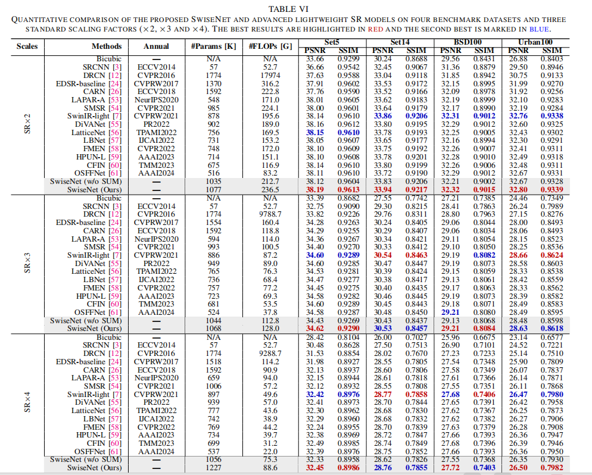

# SwiseNet-PyTorch
### **This is repository is an official PyTorch implementation of the paper "SwiseNet: Lightweight Image Super-Resolution with Scale-wise Network".**
British Machine Vision Conference (BMVC), 2023. [[Paper](https://papers.bmvc2023.org/0286.pdf)]


### Abstract 
Abstract—The multiscale information is an effective prior for various vision tasks due to the universal self-similarity of images at different scales. In this paper, we present a simple yet effective upsampling strategy for the task of efficient single image superresolution (SISR), which integrates customized multiscale priors to recover images with high definition. It introduces two parallel auxiliary branches in the upsampling, one of which infuses static downscaling information and the other one incorporates dynamic upscaling information related to the target scale. The proposed component is dubbed Scale-wise Upsampling Module (SUM) and helps to realize the interaction and synergism of multiscale priors and enlarge the effective receptive field of the model. On the other hand, in the stage of feature learning, simple gating mechanism is used to enhance the nonlinearity of the model and reduce feature dimension. Meanwhile, we conduct a more sufficient strategy for feature integration to further explore the representation capacity of the model. Our SUM can be used as a plug-and-play module in other SISR models, and achieve consistent performance gains with few extra overheads. Extensive experiments on 4 benchmark datasets have shown that although the proposed model is a naive CNN architecture, it can achieve superior SR results compared to advanced Transformer-based SISR models with higher execution efficiency. The SR results with different image degradations also illustrate that incorporating multiscale priors into the upsampling is conducive to boosting the SR performance and enhancing the generalization ability of the model, causing our method with 1.06 M parameters can exceed the RDN with 22.3M parameters.

### FAQs
1. The PSNR/SSIM reported in the paper are outdated. We have corrected the error and provided retrained models (DIV2K 1-800) and updated results. 
### Requirements
- Python 3
- [PyTorch](https://github.com/pytorch/pytorch) (0.4.0), [torchvision](https://github.com/pytorch/vision)
- Numpy, Scipy
- Pillow, Scikit-image
- h5py
- importlib


#### Contents
1. [Dataset](#Dataset)
1. [Testing](#Testing)
1. [Training](#Training)
1. [Results](#Results)
1. [Citetion](#Citetion)


### Dataset
We use DIV2K dataset for training and Set5, Set14, B100, and Urban100 dataset for the benchmark test. Here are the following steps to prepare datasets.

1. Download [DIV2K](https://data.vision.ee.ethz.ch/cvl/DIV2K) and unzip on `dataset` directory as below:
  ```
  dataset
  └── DIV2K
      ├── DIV2K_train_HR
      ├── DIV2K_train_LR_bicubic
      ├── DIV2K_valid_HR
      └── DIV2K_valid_LR_bicubic
  ```
2. To accelerate training, we first convert training images to h5 format as follow (h5py module has to be installed).
```shell
$ python div2h5.py
```
3. Other benchmark datasets can be downloaded in [Google Drive](https://drive.google.com/drive/folders/1t2le0-Wz7GZQ4M2mJqmRamw5o4ce2AVw?usp=sharing). Same as DIV2K, please put all the datasets in `dataset` directory.

### Testing
We provide the pretrained models in `checkpoint` directory. To test SwiseNet on benchmark dataset:
```shell
# Scale factor x2
$ python Sample.py      --test_data_dir dataset/<dataset> --scale 2 --upscale 3 --ckpt_path ./checkpoint/<path>.pth --sample_dir <sample_dir>

# Scale factor x3                
$ python Sample.py      --test_data_dir dataset/<dataset> --scale 3 --upscale 4 --ckpt_path ./checkpoint/<path>.pth --sample_dir <sample_dir>

# Scale factor x4
$ python Sample.py      --test_data_dir dataset/<dataset> --scale 4 --upscale 5 --ckpt_path ./checkpoint/<path>.pth --sample_dir <sample_dir>
```

### Training
Here are our settings to train SwiseNet. Note: We use two GPU to utilize large batch size, but if OOM error arise, please reduce batch size.
```shell
# Scale factor x2
$ python train.py --patch_size 64 --batch_size 64 --max_steps 600000 --lr 0.001 --decay 150000 --scale 2  --upscale 3

# Scale factor x3
$ python train.py --patch_size 64 --batch_size 64 --max_steps 600000 --lr 0.001 --decay 150000 --scale 3  --upscale 4

# Scale factor x4
$ python train.py --patch_size 64 --batch_size 64 --max_steps 600000 --lr 0.001 --decay 150000 --scale 4  --upscale 5               
                      
 ```

**Note:** The PSNR and SSIM reported in the paper are outdated. We have updated the results as following:
<div align="center">



</div>
</p>
</details>


## Citation
```
@inproceedings{nerti982023swisenet,
  title={SwiseNet: Lightweight Image Super-Resolution with Scale-wise Network},
  author={Xiaoaole Zhao , Xinkun Wu},
  booktitle={British Machine Vision Conference},
  year={2023}
}
```


 
